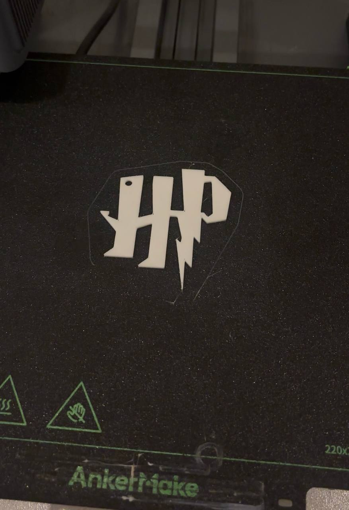

# 3D Harry Potter Keychain Design & 3D Print

## Overview
This repository documents the design and fabrication of a custom Harry Potter HP logo keychain. The project involved converting a 2D logo into a 3D CAD model using Onshape, preparing the parametric features and key ring hole, exporting to STL format, and final FDM 3D printing.

---

## Quick Summary of Workflow
1. 2D Tracing & Sketching: Imported the iconic HP logo and created a closed-loop 2D sketch.
2. Key Ring Attachment: Added a 4 mm circular cut-out on the upper left arm of the 'H' letter for split-ring insertion.
3. 3D Feature Extrusion: Applied a uniform Extrude Depth to turn the 2D sketch into a solid 3D printable model.
4. STL Export & Slicing: Exported the final model to STL format for 3D printing preparation.

---

## Visual Documentation

### CAD Model Preview

### 3D Printed Output

---

## Technical Specifications & Parameters

| Parameter | Value / Tool Used | Description |
| :--- | :--- | :--- |
| CAD Platform | Onshape | 2D Sketching, Feature Extrusion, & Assembly |
| Extrude Depth | 2 mm | Thickness of the keychain base |
| Hole Diameter | 4 mm | Dedicated key ring attachment hole |
| 3D Printing Technology | FDM (Fused Deposition Modeling) | 3D Printing method used for fabrication |
| Print Material | PLA Filament | Thermoplastic material used for printing |
| Slicer Software | Ultimaker Cura / PrusaSlicer | Used to generate G-code from STL |

---

## Files & Project Links
* Download STL File: [Click Here to Download STL File](./Harry_Potter_Keychain.stl)

