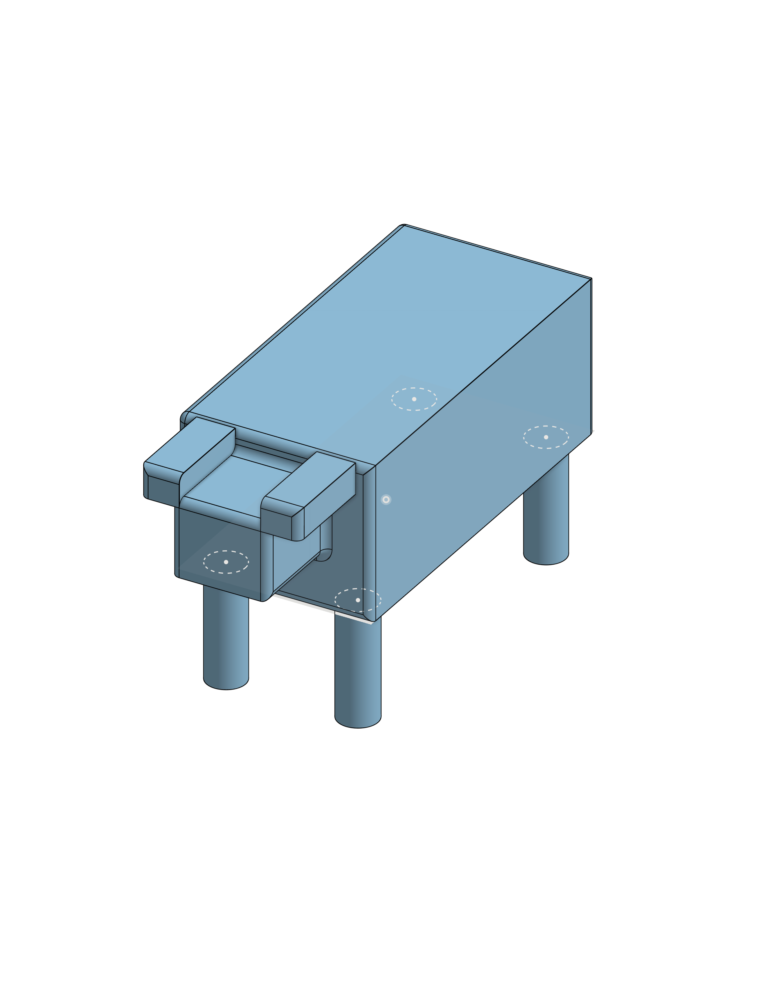

# 3D Blocky Robotic Dog CAD Model

## Overview
This repository contains the initial 3D CAD design for a four-legged robotic dog, developed in Onshape. While the visual design is currently a foundational, blocky interpretation, the primary value of this project lies in the learning journey. It represents my initial practical application of essential Onshape tools, focusing on creating and positioning foundational geometric primitives, mastering basic assembly, and preparing a simple multi-part model for 3D printing export.

---

## Technical Specifications & Learning Milestones
* Design Platform: Onshape 3D CAD
* Visual Style: Simplified Geometric (Blocky) Structure
* Project Type: Learning Task (Initial CAD Application)
* Manufacturing Compatibility: Designed for FDM 3D printing
* Primary Learning Tools Used:
  * Fundamental Sketching (rectangles, circles)
  * Standard Extrusion
  * Linear Patterning (for consistent leg spacing)
  * Transform Tool (moving and aligning parts in 3D space)
  * Basic Assembly (grouping parts together)

---

## Design Tools Utilized & Takeaways

The development process, while resulting in a simple design, was highly beneficial for practicing critical CAD operations:
1. Geometric Primitives Management: Practiced creating diverse shapes like a long rectangular prism for the body, a cube with rounded edges for the head, and cylinders for the legs, which are fundamental building blocks for any CAD project.
2. Symmetrical Patterning: Utilized the Linear Pattern tool to ensure all four legs were perfectly symmetrical in size and spacing, ensuring a stable foundation.
3. Multi-Part Positioning: Mastered the placement of different geometric components in 3D space, learning how to align the head and legs correctly with the main body chassis.
4. Boolean Joining (Union): Practiced combining all the different parts into a single, unified 3D solid, which is crucial for clean and error-free 3D printing.

---

## Visual Documentation

### CAD Model Preview

---

## Project Files & Links
* Download STL File: [Click Here to Download STL File](./robot.dog.stl)
