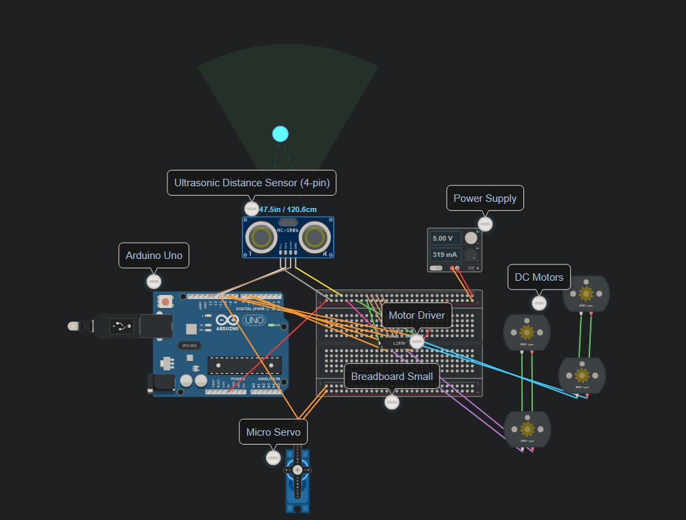

# Autonomous 4-Motor Robot Simulation with L293D & Ultrasonic Sensor

## Overview
This repository contains the complete simulation for a 4-wheel drive (4WD) robot controlled by an Arduino Uno and an L293D Motor Driver IC. The system runs a predefined motion sequence (Forward, Backward, Alternate Turning) while implementing active obstacle detection using an HC-SR04 Ultrasonic Sensor and a Servo Motor.

---

## System Preview

### Circuit Diagram



---

## Components Used
* **Arduino Uno**
* **L293D Motor Driver IC**
* **4x DC Motors**
* **HC-SR04 Ultrasonic Distance Sensor**
* **Micro Servo Motor**
* **External Power Supply** (5V for high-current motors)
* **Breadboard & Jumper Wires**

---

## Pin Configuration

| Component | Arduino Pin / Target | Description |
| :--- | :--- | :--- |
| **L293D IN1** | Pin D5 | Left Motors Control (Forward) |
| **L293D IN2** | Pin D6 | Left Motors Control (Reverse) |
| **L293D IN3** | Pin D9 | Right Motors Control (Forward) |
| **L293D IN4** | Pin D10 | Right Motors Control (Reverse) |
| **Servo Signal** | Pin D11 | Servo Sweep Signal |
| **Ultrasonic Trig** | Pin D12 | Sensor Trigger |
| **Ultrasonic Echo** | Pin D13 | Sensor Echo |
| **L293D VCC2** | Power Supply (+5V) | Motor Supply Voltage |
| **Common Ground** | GND | Shared Ground Rail |

---

## System Logic & Functionality

### 1. Motion Sequence Execution
* **Forward:** All 4 DC motors drive forward for **30 seconds**.
* **Backward:** All 4 DC motors reverse direction for **60 seconds**.
* **Alternating Turns:** The robot continuously alternates between left and right turns for **60 seconds**.

### 2. Obstacle Avoidance Mechanism
* The **HC-SR04 Ultrasonic Sensor** measures distance continuously.
* If an obstacle is detected at a distance of **$\le 10\text{ cm}$**:
  * All DC motors **STOP** immediately.
  * The **Servo Motor** rotates to scan the surroundings ($0^\circ \rightarrow 180^\circ \rightarrow 90^\circ$).

---

## Troubleshooting & Technical Challenges

During the simulation setup on Tinkercad, several wiring issues were identified and resolved:

1. **Short Circuit Errors:**
   * **Issue:** Direct connections between $5\text{V}$ power and shared GND lines on the breadboard caused circuit failures.
   * **Solution:** Re-routed power distribution rails to isolate power lines.

2. **Pin Overcurrent Error (`Current through I/O pin D5 exceeds maximum`):**
   * **Issue:** Pin D5 drew $96.4\text{ mA}$, exceeding the Arduino safety threshold ($40.0\text{ mA}$).
   * **Solution:** Corrected the connection to direct D5 into the high-impedance `Input 1` pin of the L293D driver instead of high-load nodes.

3. **Asynchronous Motors (0 RPM on Right Side):**
   * **Issue:** Only left motors rotated while right-side motors remained idle.
   * **Solution:** Verified H-bridge logic and connected `Enable 3,4` (Pin 9 on L293D) to $+5\text{V}$ to enable current flow to the right-side outputs.

---

## Source Code

```cpp
#include <Servo.h>

// Pin Definitions
const int IN1 = 5;
const int IN2 = 6;
const int IN3 = 9;
const int IN4 = 10;
const int SERVO_PIN = 11;
const int TRIG_PIN = 12;
const int ECHO_PIN = 13;

Servo myServo;

void setup() {
  // Set motor driver pins as outputs
  pinMode(IN1, OUTPUT);
  pinMode(IN2, OUTPUT);
  pinMode(IN3, OUTPUT);
  pinMode(IN4, OUTPUT);
  
  // Set ultrasonic sensor pins
  pinMode(TRIG_PIN, OUTPUT);
  pinMode(ECHO_PIN, INPUT);
  
  // Attach servo motor and set default position to center (90 degrees)
  myServo.attach(SERVO_PIN);
  myServo.write(90);
}

// Function to calculate clearance distance using the HC-SR04 sensor
long getDistance() {
  digitalWrite(TRIG_PIN, LOW);
  delayMicroseconds(2);
  digitalWrite(TRIG_PIN, HIGH);
  delayMicroseconds(10);
  digitalWrite(TRIG_PIN, LOW);
  
  long duration = pulseIn(ECHO_PIN, HIGH);
  long distance = duration * 0.034 / 2; // Convert pulse time to centimeters
  return distance;
}

// Motor Control Functions
void stopMotors() {
  digitalWrite(IN1, LOW);
  digitalWrite(IN2, LOW);
  digitalWrite(IN3, LOW);
  digitalWrite(IN4, LOW);
}

void moveForward() {
  digitalWrite(IN1, HIGH);
  digitalWrite(IN2, LOW);
  digitalWrite(IN3, HIGH);
  digitalWrite(IN4, LOW);
}

void moveBackward() {
  digitalWrite(IN1, LOW);
  digitalWrite(IN2, HIGH);
  digitalWrite(IN3, LOW);
  digitalWrite(IN4, HIGH);
}

void turnLeft() {
  digitalWrite(IN1, LOW);
  digitalWrite(IN2, HIGH);
  digitalWrite(IN3, HIGH);
  digitalWrite(IN4, LOW);
}

void turnRight() {
  digitalWrite(IN1, HIGH);
  digitalWrite(IN2, LOW);
  digitalWrite(IN3, LOW);
  digitalWrite(IN4, HIGH);
}

// Obstacle detection and avoidance routine
void checkObstacle() {
  // If an obstacle is detected within 10 cm or closer
  if (getDistance() <= 10) {
    stopMotors();          // Immediately stop all motors
    myServo.write(0);      // Scan right side
    delay(500);
    myServo.write(180);    // Scan left side
    delay(500);
    myServo.write(90);     // Reset servo back to center
  }
}

void loop() {
  // Phase 1: Move forward for 30 seconds
  moveForward();
  for (int i = 0; i < 300; i++) {
    checkObstacle();
    delay(100);
  }
  
  // Phase 2: Reverse/Move backward for 60 seconds (1 minute)
  moveBackward();
  for (int i = 0; i < 600; i++) {
    checkObstacle();
    delay(100);
  }
  
  // Phase 3: Alternating turns (Left & Right) for 60 seconds (1 minute)
  for (int i = 0; i < 30; i++) {
    turnLeft();
    checkObstacle();
    delay(1000);
    
    turnRight();
    checkObstacle();
    delay(1000);
  }
}
